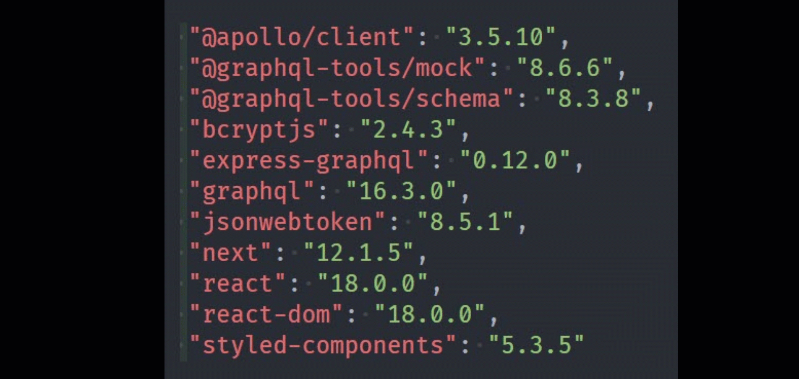

## Next.js, GraphQL and E-commerce

### Simple e-commerce store using Next.js, GraphQL, Apollo-client and JWT authorization
#### [Next.js](https://nextjs.org/) 

Next.js version 12 is a major release that introduces improved developer experience, faster build times, and new features such as built-in image optimization and automatic static optimization. It also includes a new API route for serverless functions, improved TypeScript support, and more.

Used by some of the world's largest companies, Next.js enables you to create full-stack web applications by extending the latest React features, and integrating powerful Rust-based JavaScript tooling for the fastest builds.

#### [GraphQL](https://graphql.org/) 

 GraphQL is a query language for APIs and a runtime for fulfilling those queries with your existing data. It provides a complete and understandable description of the data in your API, gives clients the power to ask for exactly what they need and nothing more, makes it easier to evolve APIs over time, and enables powerful developer tools.

#### [Apollo-client](https://www.apollographql.com/docs/react/) 

Apollo Client is a comprehensive state management library for JavaScript that enables you to manage both local and remote data with GraphQL. It is designed to help you quickly build powerful and modern apps.

 #### [JWT](https://jwt.io/) 

 JSON Web Token (JWT) is an open standard (RFC 7519) that defines a compact and self-contained way for securely transmitting information between parties as a JSON object. It is used for authorization and information exchange, especially in web applications and microservices.

### Demo example:

##### Contact with me: 
[][linkedin]

[linkedin]: https://www.linkedin.com/in/sergiy-antonyuk/